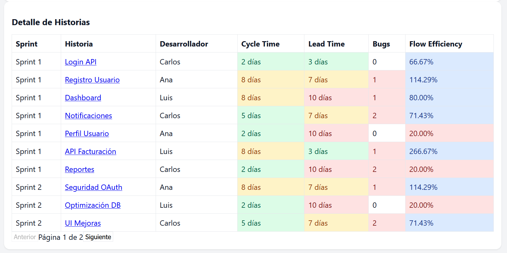

# Team Performance Dashboard


Este proyecto es un panel de métricas técnicas diseñado para ayudar a un líder técnico o a un equipo de desarrollo a analizar y mejorar su flujo de trabajo.
El objetivo no es únicamente medir el rendimiento, sino identificar oportunidades de mejora y detectar cuellos de botella en el proceso de desarrollo.

A través de este dashboard se capturan tres métricas clave:

Cycle Time: mide cuánto tiempo transcurre desde que una historia comienza su desarrollo hasta que está lista para ser desplegada.
👉 Permite entender la agilidad del equipo al completar tareas.

Lead Time for Changes: mide el tiempo total desde que inicia el sprint hasta que el cambio llega a producción.
👉 Ayuda a analizar la efectividad del proceso de entrega (planificación, pruebas, despliegues).

Flow Efficiency (Eficiencia de Flujo): calcula el porcentaje del tiempo total en que las tareas estuvieron en trabajo activo (Cycle Time / Lead Time).
👉 Permite ver cuánta parte del proceso se dedica a trabajo real frente a tiempo de espera.

Además, el panel registra:

Cantidad de bugs reportados por historia, para identificar problemas de calidad o de revisiones de código.

Promedios por desarrollador y por sprint, para analizar tendencias de rendimiento y eficiencia.

🎯 Objetivo principal

El objetivo del panel es dar visibilidad completa al ciclo de entrega del equipo, ayudando a responder preguntas como:

- ¿Dónde se generan los retrasos (revisiones, QA, despliegues)?

- ¿Qué tan eficiente es nuestro flujo de trabajo?

- ¿Hay historias con demasiado tiempo inactivo o con muchos bugs?

Con esta información, los líderes técnicos pueden tomar decisiones informadas sobre:

- Mejorar procesos de revisión de código.

- Ajustar tamaños de historias.

- Fortalecer las pruebas automáticas o la integración continua.

- Detectar patrones que impactan la calidad o la velocidad de entrega.


## Fórmulas y definiciones
- **Cycle Time**: tiempo activo de la tarea (In Progress -> Ready for Deploy).
🟢 Verde (≤ 5 días)

Significa que el equipo entrega historias rápidamente.
👉 Buen flujo de trabajo, tareas bien planificadas y sin bloqueos.

🟡 Amarillo (>5 y <10 días)

Entrega moderada, pero podría mejorarse.
👉 Puede haber pequeñas esperas o tareas algo grandes.

🔴 Rojo (≥10 días)

Entrega lenta.
👉 Probablemente hay problemas de dependencias, revisiones lentas o historias muy grandes.
Se recomienda analizar cuellos de botella.

- **Lead Time for Changes (LTC)**: tiempo total desde que la tarea es solicitada hasta deploy.
🟢 ≤5 días: despliegue rápido → proceso ágil.

🟡 5–10 días: despliegue algo lento → se puede optimizar CI/CD o testing.

🔴 ≥10 días: despliegue tardío → revisar flujos de aprobación, QA o infraestructura.



- **Flow Efficiency**:
```
Flow Efficiency (%) = (Cycle Time / Lead Time) * 100
```
Se calcula por historia y por desarrollador (promedio).

🔵 Azul (>60%)

Muy buena eficiencia: la mayor parte del tiempo la historia estuvo en trabajo activo, no esperando.
👉 El equipo tiene buen flujo y pocas esperas.

🟡 Amarillo (50–60%)

Eficiencia aceptable, pero podría mejorarse.
👉 Hay cierto tiempo de espera (QA, revisiones, bloqueos).

🔴 Rojo (<50%)

Mala eficiencia: más de la mitad del tiempo la historia estuvo detenida.
👉 Se debe investigar en qué fases se generan esperas.

## Cómo ejecutar (local)
1. Instala dependencias:
```bash
npm install
```
2. Levanta el dev server:
```bash
npm run dev
```
3. Abre `http://localhost:5173` (o la URL que muestre Vite).

## Conectar Google Sheets (opcional)
- Publica tu hoja: **Archivo -> Publicar en la web** -> seleccionar hoja -> formato CSV.
- Copia el enlace (`.../pub?output=csv`) y descomenta el bloque de `fetch` en `TeamPerformanceDashboard.jsx`.
- Asegúrate que las columnas de la hoja coincidan con:
  - `Sprint`, `Historia`, `Desarrollador`, `Cycle Time (días)`, `Lead Time for Changes (días)`, `Bugs reportados`
- La app usa `papaparse` para parsear CSV.


## Notas
- Los colores y umbrales son configurables en los helpers al final del archivo `TeamPerformanceDashboard.jsx`.
- Si quieres lectura/escritura segura desde Google Sheets, lo ideal es crear una API intermedia con credenciales (Service Account).

