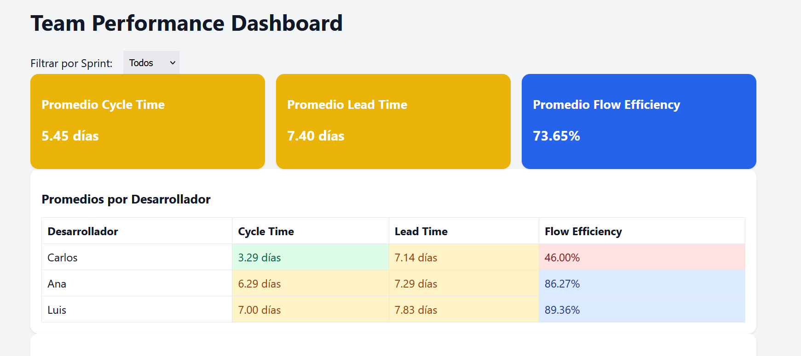

# Team Performance Dashboard


Pequeña app React (Vite) para visualizar métricas del un Team de desarrolladores y métricas de flujo (Cycle Time, Lead Time, Flow Efficiency).


## Qué muestra la app
1. **Promedio general** (cards, fondo coloreado según umbrales):
   - Promedio Cycle Time (días) 
   - Promedio Lead Time (días) 
   - Promedio Flow Efficiency (%) 
2. **Promedios por desarrollador**:
   - Cycle Time (promedio/días)
   - Lead Time (promedio/días) 
   - Flow Efficiency (promedio/días)
3. **Tabla de detalle**:
   - Sprint
   - Historia 
   - Desarrollador
   - Cycle Time (días)
   - Lead Time (días)
   - Bugs reportados (si > 0 se marca en rojo)
   - Flow Efficiency (%)
   - Paginación: 10 resultados por página.

## Fórmulas y definiciones
- **Cycle Time**: tiempo activo de la tarea (In Progress -> Ready for Deploy).
🟢 Verde (≤ 5 días)

Significa que el equipo entrega historias rápidamente.
👉 Buen flujo de trabajo, tareas bien planificadas y sin bloqueos.

🟡 Amarillo (>5 y <10 días)

Entrega moderada, pero podría mejorarse.
👉 Puede haber pequeñas esperas o tareas algo grandes.

🔴 Rojo (≥10 días)

Entrega lenta.
👉 Probablemente hay problemas de dependencias, revisiones lentas o historias muy grandes.
Se recomienda analizar cuellos de botella.

- **Lead Time for Changes (LTC)**: tiempo total desde que la tarea es solicitada hasta deploy.
🟢 ≤5 días: despliegue rápido → proceso ágil.

🟡 5–10 días: despliegue algo lento → se puede optimizar CI/CD o testing.

🔴 ≥10 días: despliegue tardío → revisar flujos de aprobación, QA o infraestructura.

- **Flow Efficiency**:
```
Flow Efficiency (%) = (Cycle Time / Lead Time) * 100
```
Se calcula por historia y por desarrollador (promedio).

🔵 Azul (>60%)

Muy buena eficiencia: la mayor parte del tiempo la historia estuvo en trabajo activo, no esperando.
👉 El equipo tiene buen flujo y pocas esperas.

🟡 Amarillo (50–60%)

Eficiencia aceptable, pero podría mejorarse.
👉 Hay cierto tiempo de espera (QA, revisiones, bloqueos).

🔴 Rojo (<50%)

Mala eficiencia: más de la mitad del tiempo la historia estuvo detenida.
👉 Se debe investigar en qué fases se generan esperas.

## Cómo ejecutar (local)
1. Instala dependencias:
```bash
npm install
```
2. Levanta el dev server:
```bash
npm run dev
```
3. Abre `http://localhost:5173` (o la URL que muestre Vite).

## Conectar Google Sheets (opcional)
- Publica tu hoja: **Archivo -> Publicar en la web** -> seleccionar hoja -> formato CSV.
- Copia el enlace (`.../pub?output=csv`) y descomenta el bloque de `fetch` en `DoraMetricsDashboard.jsx`.
- Asegúrate que las columnas de la hoja coincidan con:
  - `Sprint`, `Historia`, `Desarrollador`, `Cycle Time (días)`, `Lead Time for Changes (días)`, `Bugs reportados`
- La app usa `papaparse` para parsear CSV.


## Notas
- Los colores y umbrales son configurables en los helpers al final del archivo `DoraMetricsDashboard.jsx`.
- Si quieres lectura/escritura segura desde Google Sheets, lo ideal es crear una API intermedia con credenciales (Service Account).

